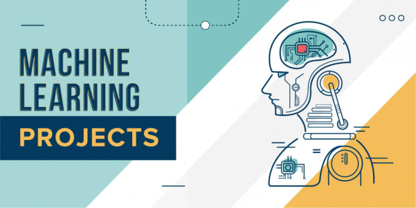

# Machine-Learning
Machine Learning Projects

:heavy_check_mark: Boston Home Prices Prediction and Evaluation, Python and scikit-learn.

:heavy_check_mark: Creating Customer Segments, PCA, Python and scikit-learn.

:heavy_check_mark: Faces recognition using eigenfaces and SVMs, Python and scikit-learn. 

:heavy_check_mark: Finding Donors, Python and scikit-learn.

:heavy_check_mark: Football Predictions LaLiga Spanish, Python and scikit-learn.

:heavy_check_mark: K-means clustering of movie ratings, Python and scikit-learn.

:heavy_check_mark: Predict Stock Prices, Python and Tensorflow, LSTM.

:heavy_check_mark: Spam detector, Python and scikit-learn.
